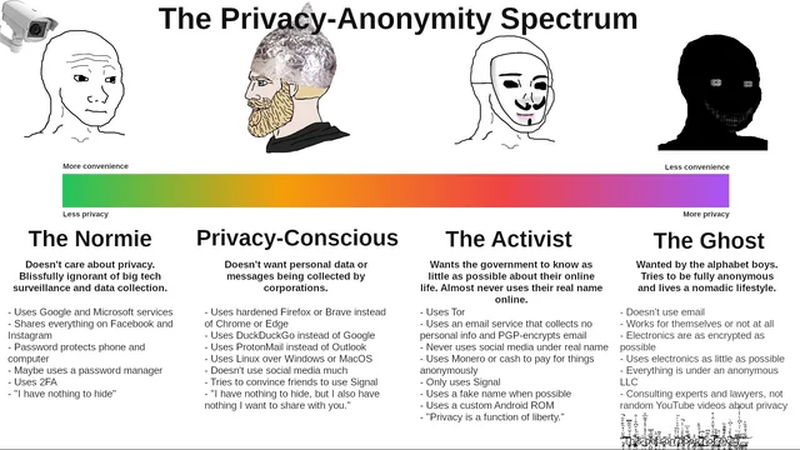
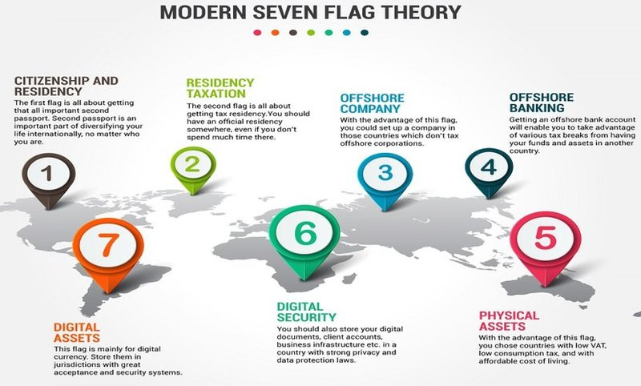

<!DOCTYPE html>
<html>
<body>
<h1>🕵🌐👤🤫 ANONYMITY 🤫👤🌐🕵</h1>

<!-- TAKE OUT SON OF BITCH ;D -->

<pre>"The primary threat facing someone trying to stay anonymous on the internet today
is their own bad opsec, and that is precisely the same as it was in 2013. Tails and Tor 
reduced the number of ways anyone on my team could make dangerous mistakes, and so were
crucial protections." (Edward Snowden)</pre>

<!-- ################################################################################# -->

  
<h3>BEST REFERENCES</h3>
<table valign="top" style="width: 100%; border: none;" cellspacing="0" cellpadding="0">
<thead>
<tr>
<td valign="top" style="height:100%">
<a href="https://www.whonix.org/wiki/Tips_on_Remaining_Anonymous" target="_blank" rel="noopener noreferrer">Whonix - Tips on Remaining Anonymous</a> 
<a href="https://hackmd.io/YKjhguQES_KeKYs-v1YC1w?view" target="_blank" rel="noopener noreferrer">HackMD - How to stay anon</a> 
<a href="https://www.eff.org/" target="_blank" rel="noopener noreferrer">EFF Fundation</a> 
<a href="https://www.securityeducationcompanion.org/" target="_blank" rel="noopener noreferrer">EFF - Security Companion</a> 
<a href="https://github.com/danoctavian/awesome-anti-censorship" target="_blank" rel="noopener noreferrer">Awesome Anti-censorship</a> 
<a href="https://github.com/shadawck/awesome-anti-forensic" target="_blank" rel="noopener noreferrer">Awesome Anti-forensic</a> 
<a href="https://forensics.wiki/anti_forensic_techniques" target="_blank" rel="noopener noreferrer">Anti-forensic Techniques</a> 
<a href="https://github.com/PaulNorman01/Forensia" target="_blank" rel="noopener noreferrer">Forensia</a> 
<a href="https://evasions.checkpoint.com" target="_blank" rel="noopener noreferrer">Evasion Techniques</a> 
<a href="https://github.com/mikeroyal/Open-Source-Security-Guide" target="_blank" rel="noopener noreferrer">Open Source Security Guide</a> 
<a href="https://github.com/ffffffff0x/Digital-Privacy" target="_blank" rel="noopener noreferrer">Digital Privacy</a> 
<a href="https://github.com/BlockchainCommons/Pseudonymity-Guide" target="_blank" rel="noopener noreferrer">Pseudonymity Guide</a> 
</td>

<td valign="top" style="height:100%">
<a href="https://privacy.sexy/" target="_blank" rel="noopener noreferrer">Privacy Sexy</a> 	
<a href="https://github.com/Lissy93/personal-security-checklist" target="_blank" rel="noopener noreferrer">Personal Security Checklist</a> 	
<a href="https://github.com/KevinColemanInc/awesome-privacy" target="_blank" rel="noopener noreferrer">Awesome Privacy</a> 	
<a href="https://github.com/awesome-vpn/awesome-vpn" target="_blank" rel="noopener noreferrer">Awesome VPN</a> 	
<a href="https://github.com/awesome-selfhosted/awesome-selfhosted" target="_blank" rel="noopener noreferrer">Awesome Self-hosted</a> 	
<a href="https://github.com/cryptoanarchywiki/cryptoanarchywiki.github.io" target="_blank" rel="noopener noreferrer">Cryptoanarchy Wiki</a> 	
<a href="https://github.com/tombusby/cypherpunk-research" target="_blank" rel="noopener noreferrer">Cypherpunk Research</a> 	
<a href="https://freedom.press/training" target="_blank" rel="noopener noreferrer">Freedom Press</a> 	
<a href="https://www.techsafety.org" target="_blank" rel="noopener noreferrer">Safety Net Project</a> 
<a href="https://nomoregoogle.com/" target="_blank" rel="noopener noreferrer">No More Google</a> 
</td>

<td valign="top" style="height:100%">
<a href="https://joindeleteme.com" target="_blank" rel="noopener noreferrer">Join Delete Me</a> 
<a href="https://www.accountkiller.com" target="_blank" rel="noopener noreferrer">Account Killer</a> 
<a href="https://spreadprivacy.com" target="_blank" rel="noopener noreferrer">Spread Privacy</a> 
<a href="https://prism-break.org" target="_blank" rel="noopener noreferrer">Prism-Break</a> 
<a href="https://www.privacyguides.org  " target="_blank" rel="noopener noreferrer">Privacy Guides</a> 
<a href="https://privacytools.io" target="_blank" rel="noopener noreferrer">Privacy Tools</a> 
<a href="https://proprivacy.com" target="_blank" rel="noopener noreferrer">Pro Privacy</a> 
<a href="https://haveibeenpwned.com" target="_blank" rel="noopener noreferrer">Have I Been Pwned ?</a> 
<a href="https://www.whois.com" target="_blank" rel="noopener noreferrer">Whois</a> 
<a href="https://gdpr-info.eu/issues/right-to-be-forgotten" target="_blank" rel="noopener noreferrer">GDPR - Right to be forgotten</a> 
</td>

</tr>
</thead>
</table>

 

<!-- ################################################################################# -->

<h3>Privacy vs. Anonymity</h3>

<table>
<thead>
  <tr>
    <th colspan="2" rowspan="2">PRIVACY VS. ANONYMITY</th>
    <th colspan="3">PRIVACY</th>
  </tr>
  <tr>
    <th>PUBLIC</th>
    <th>SEMI-PRIVATE</th>
    <th>PRIVATE</th>
  </tr>
</thead>
<tbody>
  <tr>
    <td rowspan="3">ANONYMITY</td>
    <td>TRUE IDENTITY</td>
    <td>Public business deal</td>
    <td>Online credit card transaction</td>
    <td>Cash transaction between friends</td>
  </tr>
  <tr>
    <td>PSEUDO-ANONYMOUS</td>
    <td>Public auction with unnamed buyer</td>
    <td>Centralized marketplace sale with Bitcoin</td>
    <td>Descentralized marketplace sale with Bitcoin</td>
  </tr>
  <tr>
    <td>ANONYMOUS</td>
    <td>Wikileaks annouces anonymous cryptocyrrency donation</td>
    <td>Centralized marlketplace sale with annonymous  cryptocurrency</td>
    <td>Descentralized marketplace sale with anonnymous cryptocurrency (Monero)</td>
  </tr>
</tbody>
</table>

<!-- ################################################################################# -->

 

<!-- ################################################################################# -->

Flag Theory - https://flagtheory.com 

 

<!-- ################################################################################# -->

 

 

<pre></pre>

<!-- ################################################################################# -->

ONLINE ANONYMITY​​​​​

 

<h3>Anonymous Developer</h3>

<b>How to create an anonymous GitHub</b>

This is a short guide to help you start developing an anonymous developer account.

1. Create a new browser profile in your browser of choice
    * Firefox and derivatives: https://support.mozilla.org/en-US/kb/profile-manager-create-remove-switch-firefox-profiles
    * Chrome and derivaties: https://support.google.com/chrome/answer/2364824?hl=en&co=GENIE.Platform%3DDesktop
2. Create a new [Protonmail](https://protonmail.com/) account. 
    * Protonmail doesn't ask for any personally identifiable information when setting up a new account
    * For recovery options, ensure that you don't use an email that can dox or your phone number
3. Create a corresponding [ProtonVPN](https://protonvpn.com) account
    * Use this VPN whenever you are in *anon* mode
4. Create a [GitHub](https://github.com/) account with your new email
    * Generate new SSH keys and add them to this GitHub account
5. Create a new [Twitter](https://twitter.com) account with your new identity
6. Create a new [Reddit](https://www.reddit.com/) account with your new identity
    * Use a request subreddit of your choice to get a new unique pfp for your new anon account
7. Create a [cryptpad.fr](https://cryptpad.fr/) and a hackmd account for all your note taking, and encrypted storage needs
8. Go on [privacytools.io](https://www.privacytools.io/) for other tools that you can use to keep yourself private
9. (Optional) Install ublock origin, privacy badger and https everywhere in your new browser profile
10. Extra reading and considerations: [0xngmi's guide for staying anon](https://hackmd.io/YKjhguQES_KeKYs-v1YC1w?view)

Credits: https://github.com/Mikerah/anon-guide

<b>How to erase GitHub history</b>

Credits: https://github.com/fedebotu/clone-anonymous-github

<b>Contribute Code Anonymously</b>

Credits: https://github.com/AnalogJ/gitmask

<b>Proxy server to support anonymous browsing</b>

Credits: https://durieux.me/projects/anonymous-github.html
Credits: https://github.com/tdurieux/anonymous_github

<!-- ################################################################################# -->

<h3>SECURE OPERATING SYSTEMS</h3>

<h3>Tails</h3>

 
 
 

<h4>Protocol Leak and Fingerprinting Protection</h4>  
https://www.whonix.org/wiki/Protocol-Leak-Protection_and_Fingerprinting-Protection#Less_important_identifiers 

<h4>Attacks on Tor</h4>  
https://github.com/Attacks-on-Tor/Attacks-on-Tor 

<h3>Whonix</h3>
https://www.whonix.org 

<h3>Tails Vs. Whonix</h3>
https://www.whonix.org/wiki/Comparison_with_Others 

<h3>QubesOS</h3>

<h3>Anon Internet</h3>
• Tor - https://www.torproject.org - Tor is free software and an open network that helps you defend against traffic analysis. 
• I2P - https://geti2p.net/en/ - I2P is an anonymous overlay network - a network within a network. It is intended to protect communication from dragnet surveillance and monitoring by third parties such as ISPs. 
• Freenet - https://freenetproject.org - Freenet is free software which lets you anonymously share files, browse and publish "freesites" (web sites accessible only through Freenet) and chat on forums, without fear of censorship. 
• Zeronet - https://zeronet.io - Open, free and uncensorable websites, using Bitcoin cryptography and BitTorrent network 
• Loki - https://github.com/loki-project/loki-network - Lokinet is an anonymous, decentralized and IP based overlay network for the internet. 
• IPFS - https://ipfs.io - A peer-to-peer hypermedia protocol designed to make the web faster, safer, and more open. 
• Yggdrasil - https://yggdrasil-network.github.io/about.html - Makes use of a global spanning tree to form a scalable IPv6 encrypted mesh network. 
• Nym -  

<h3>Anonymous VPN</h3>
• Mullvad - https://mullvad.net 
• Mullvad - http://o54hon2e2vj6c7m3aqqu6uyece65by3vgoxxhlqlsvkmacw6a7m7kiad.onion 
• ProtonVPN - https://protonvpn.com 
• AirVPN - https://airvpn.org 
• IVPN - https://www.ivpn.net  
• VPN.XXX - https://www.vpn.xxx 
• Windscribe - https://windscribe.com 
• ExpressVPN - https://www.expressvpn.com/vpnmentor1 
• NordVPN - https://nordvpn.com 
• Private Internet Access - https://www.privateinternetaccess.com 

<h3>VPN Guides and Tutorials</h3>
• r/vpnrecommendations - https://www.reddit.com/r/vpnrecommendations 
• r/VPN - https://www.reddit.com/r/VPN/wiki/index 
• r/VPNTorrents - https://www.reddit.com/r/VPNTorrents 
• Choosing the best VPN (for you) - https://www.reddit.com/r/VPN/comments/4iho8e/that_one_privacy_guys_guide_to_choosing_the_best/?st=iu9u47u7&sh=459a76f2 
• Choosing the VPN that's right for you - https://ssd.eff.org/en/module/choosing-vpn-thats-right-you 
• VPN Alert - https://vpnalert.com 
• That One Privacy Site - https://thatoneprivacysite.net/vpn-section 
• privacytools.io - https://www.privacytools.io 
• VPN over SSH - https://wiki.archlinux.org/index.php/VPN_over_SSH 
 

<b>TOR, VPN and Proxy</b>
 
https://www.rapidseedbox.com/blog/vpn-vs-proxy 

<!-- ################################################################################# -->

<h3>• Random MAC Address</h3>

<pre>
&nbsp; Commands
&nbsp; &nbsp; $ ip link
&nbsp; &nbsp; $ sudo ifconfig wlan0 down
&nbsp; &nbsp; $ sudo macchanger -r wlan0
&nbsp; &nbsp; • Shows specified MAC Address of NIC
&nbsp; &nbsp; $ sudo macchanger -s wlan0
&nbsp; &nbsp; $ sudo ifconfig wlan0 up
</pre>

<h3>• Opt-Out WLAN-SSID</h3>

To opt-out of <b>global maps</b> (https://wigle.net), rename your network WiFi SSID to
<pre> &lt;SSID&gt;_optout_nomap </pre>

<h3>• To opt-out of Mozilla Location Services</h3>

Go to https://location.services.mozilla.com/optout 

<h3>Anonymous Communication</h3>
• Matrix Protocol - https://matrix.org 
• Signal - https://community.signalusers.org/t/overview-of-third-party-security-audits/13243 
• Discord Bot 
• Mastadon 
• https://github.com/onionshare/onionshare 

<h3>Email</h3>

<b>Privacy</b> 
• Protonmail - 
• https://www.grepular.com/Skiff_Emails_Various_Privacy_Failures 

<b>Self-hosted</b> 
• Reddit Thread - https://www.reddit.com/r/selfhosted/comments/isu8mw/selfhosted_throw_away_email_addresses_that_allow/ 
• Burnermail.io - https://burnermail.io/ 
• Anonaddy.com - https://anonaddy.com/#pricing 
• Simplelogin.io - https://simplelogin.io/ 
• Simplelogin.io github repo - https://github.com/simple-login/app 
• Forward Email - https://forwardemail.net/en 

<b>Temp Email</b> 
• 10MinuteMail - https://10minutemail.com 
• http://www.yopmail.com/zh 
• https://www.guerrillamail.com/zh/inbox 
• http://www.fakemailgenerator.com 
• https://temp-mail.org/en 
• https://www.guerrillamail.com 
• http://tool.chacuo.net/mailsend 
• https://maildrop.cc 
• http://tool.chacuo.net/mailanonymous 
• https://tempmail.altmails.com 
• https://www.snapmail.cc 
• https://www.linshi-email.com 

<h3>Generators</h3>

<b>Utilities and Spoof</b> 
• Text Fixer - https://www.textfixer.com 
• SS64 Syntax Utils - https://ss64.com  
• Tools4noobs - https://www.tools4noobs.com 

<b>Name, Address, IDs Generators</b> 
• Text to ASCII Art Generator - https://patorjk.com/software/taag 
• Fake Name Generator - https://www.fakenamegenerator.com 
• Fake Address, Random Address Generator - https://www.fakeaddressgenerator.com/Index/index 
• Behind the Name - https://www.behindthename.com/random 
• Easy Random Name Picker - https://randomwordgenerator.com/name.php  
• Random User Generator - https://randomuser.me  
• ID Free Site - https://id.ifreesite.com  
• Fake ID - https://www.elfqrin.com/fakeid.php 
• Credit Card Generator - https://www.elfqrin.com/discard_credit_card_generator.php  
• Credit Card BINs generator and validator - https://www.elfqrin.com/credit_card_bin_generator.php  
• US SSN / Driver License (DL) / State ID / Passport / Tax ID Generator - https://www.elfqrin.com/usssndriverlicenseidgen.php  
• US Car License Plates Registration Tags Generator - https://www.elfqrin.com/uscarlicenseplates.php 
• airob0t/idcardgenerator - https://github.com/airob0t/idcardgenerator 
• gh0stkey/RGPerson - https://github.com/gh0stkey/RGPerson 
• naozibuhao/idcard - https://github.com/naozibuhao/idcard 
• Just Delete Me - https://backgroundchecks.org/justdeleteme/fake-identity-generator 
• Fake Person/Name Generator | User Identity, Account and Profile Generator - https://fakepersongenerator.com 
• faker.js - https://cdn.rawgit.com/Marak/faker.js/master/examples/browser/index.html 
• Fake Person/Name Generator - https://www.fakepersongenerator.com/Index/generate 
• Full Contact Information Generator - https://names.igopaygo.com/people/full-contact 
• My Fake Information Generator and Validator - http://www.myfakeinfo.com/index.php 
• User Information Generator Articles - https://names.igopaygo.com 

<b>Image Generation</b> 
• This Person Does Not Exist - https://thispersondoesnotexist.com 
• This Cat Does Not Exist - https://thiscatdoesnotexist.com 
• This Waifu Does Not Exist - https://www.thiswaifudoesnotexist.net/?ref=appinn 
• Gallery of AI Generated Faces | Generated.photos - https://generated.photos/faces 
• Pixel-me - https://pixel-me.tokyo/en 
• Artbreeder - https://artbreeder.com/browse 
• Comixify - https://comixify.ii.pw.edu.pl 
• Which Face is Real? - http://www.whichfaceisreal.com 
• SPADE Project Page - https://nvlabs.github.io/SPADE 
• Selfie2Anime - https://selfie2anime.com 
• Reflect.tech - https://reflect.tech/faceswap/hot 
• PaddleGAN - https://github.com/PaddlePaddle/PaddleGAN 

<!-- ################################################################################# -->

<h3>OTHER CONSIDERATIONS</h3>

<b>Self-hosting</b> 
https://www.reddit.com/r/selfhosted 
https://github.com/awesome-selfhosted/awesome-selfhosted  
https://github.com/syncthing/syncthing 
https://github.com/anonaddy/anonaddy 

<b>Auditing logs, network, volatile memory</b> 
https://www.zabbix.com/documentation/current/en/manual/config/items/itemtypes/log_items 

<b>EXIF Tools</b> 
• exiftool - https://exiftool.org 
• exifcleaner - https://github.com/szTheory/exifcleaner/releases/latest 
• Exif Pilot - https://www.colorpilot.com/exif.html 

<b>Piracy</b> 
https://torrentfreak.com 
https://github.com/Igglybuff/awesome-piracy 
https://github.com/alancnet/torrent-vpn  
https://github.com/lkrjangid1/Awesome-Warez 
https://github.com/Igglybuff/awesome-piracy 
https://github.com/Illegal-Services/Illegal_Services 
https://github.com/Lucetia/piracy 
https://lemmy.dbzer0.com/c/piracy 
https://rentry.co/megathread 
https://1337x.to 
https://fitgirl-repacks.site 

<b>Others</b>  
• Deceptive Patterns  
https://www.deceptive.design  
• Not everything is secret in encrypted apps like iMessage and WhatsApp  
https://www.washingtonpost.com/technology/2023/08/22/encryption-imessage-whatsapp-google 

 

<!-- ################################################################################# -->

OFFLINE ANONYMITY​​​​​

 

<h3>BIOMETRICS ANTI-SURVEILLANCE</h3>
<b>Facial recognition</b> 
• Fawkes: Protecting Privacy against Unauthorized Deep Learning Models 
https://www.usenix.org/conference/usenixsecurity20/presentation/shan 
https://github.com/Shawn-Shan/fawkes 
• Invisible Mask: Practical Attacks on Face Recognition with Infrared  
https://arxiv.org/pdf/1803.04683.pdf  
https://www.digitaltrends.com/cool-tech/facial-recognition-hat-infrared  
• Adversarial Mask - Real-World Universal Adversarial Attack on Face Recognition Models  
https://arxiv.org/abs/2111.10759  
https://www.youtube.com/watch?v=_TXkDO5z11w
• A Poisoning Attack Against Unsupervised Template Updating" 
https://github.com/ssloxford/biometric-backdoors 

<b>Fingerprint recognition</b> 
• DEF CON Safe Mode - Yamila Levalle - Bypassing Biometric Systems with 3D Printing  
https://www.youtube.com/watch?v=hJ35ApLKpN4 

<b>Others</b> 
• Surveillance Report
https://surveillancereport.tech
• IntelTechniques
https://inteltechniques.com/links.html

<h3>DOCUMENTS ANTI-SURVEILLANCE</h3>

<b>Fake Documents</b>  
• Fake IDs - Onion Services 

<b>Bussines Inteligence</b> 
• Financial Intelligence Units (FIUs) 
Automated triage of financial intelligence reports - Algorithms 
• Artificial Intelligence, Machine Learning and Big Data in Finance 
https://www.oecd.org/finance/financial-markets/Artificial-intelligence-machine-learning-big-data-in-finance.pdf 

<b>Adversarial Machine Learning</b> 
https://github.com/yenchenlin/awesome-adversarial-machine-learning 
 
<h2>PHYSICAL ANTI-SURVEILLANCE</h2> 

<b>Hidden Objects</b> 
• How to Hide Things in Public Places - Dennis Fiery 
• DIY Secret Hiding Places: 90 Places To Hide What You Don't Want Found! - Steve Plant 
• The Big Book of Secret Hiding Places - Jack Luger 
• https://www.boredpanda.com/how-to-hide-things-secret-hiding-places 

<b>Ways law enforcement investigate</b> 
https://www.youtube.com/watch?v=zJZhPF8CuaM 
• Trash Pull 
• Malwares 
• Search Warrant 
• Photographs enhancement techniques  
• Video enhancement techniques 
• Audio enhancement techniques 
• Fingerprints 
• DNA testing 
• Blood tests 
• Ballistics 

<h3>GENERAL ANTI-SURVEILLANCE</h3>

https://paladinpressbooks.com  
https://us.artechhouse.com/storehome.aspx  

<b>The Case of Spies: American, Russian and British.</b> 
• Techniques used by spies 
- Dead drop 
-   
<b>The Case of authoritarian governments</b> 
• Techniques used by authoritarian governments 
- Secret methods of investigation (Pegasus Spyware) 
-  
<b>Anarchist Considerations</b> 
• Techniques used by anarchists 
- bib 
- https://github.com/cryptoanarchywiki/cryptoanarchywiki.github.io 

<b>Information Warfare</b> 
•  

<b>Law Warfare</b> 
•  

<b>New rhetoric</b> 
•  

<b>Counter-coulture, subversion, mimicry and criminality</b> 
•  

<b>Academic Considerations</b> 
• Antonio Gramsci (1891–1937) - Passive revolution concept 
• Gaston Bachelard (1884 - 1962) 
• Karl Popper (1902 - 1994) 
• Nicos Poulantzas (1936 - 1979) 
• Michel Foucault (1926 - 1984) 
• Louis Althusser (1918 - 1990) 

 

<!-- ################################################################################# -->

PRIVACY​​​​ ALTERNATIVES​

 

- [Nitter instances](https://github.com/zedeus/nitter/wiki/Instances) 
- [Invidious instances](https://docs.invidious.io/Invidious-Instances.md) 
- [Bibliogram instances](https://git.sr.ht/~cadence/bibliogram-docs/tree/master/docs/Instances.md) 
- [SimplyTranslate instances](https://git.sr.ht/~metalune/simplytranslate_web#list-of-instances) 
- [OpenStreetMap tile servers](https://wiki.openstreetmap.org/wiki/Tile_servers) 
- Reddit alternatives: 
  - [Libreddit](https://github.com/spikecodes/libreddit#instances) 
  - [Teddit](https://codeberg.org/teddit/teddit#instances) 
  - [Snew](https://github.com/snew/snew) 
  - [Old Reddit](https://old.reddit.com) & [Mobile Reddit](https://i.reddit.com), purported to be more privacy respecting than the new UI. 
- Google Search alternatives: 
  - [SearX](https://searx.github.io/searx/) 
  - [DuckDuckGo](https://duckduckgo.com) 
  - [Startpage](https://startpage.com) 
  - [Ecosia](https://www.ecosia.org) 
  - [Qwant](https://www.qwant.com) 
  - [Mojeek](https://www.mojeek.com) 
  - [Presearch](https://www.presearch.org) 
  - [Whoogle](https://benbusby.com/projects/whoogle-search/) 

<!-- ################################################################################# -->

 

<b>Others</b>

UNO IGF - https://www.intgovforum.org

USENIX Conferences - https://www.usenix.org/conferences

https://www.reddit.com/r/privacy

https://www.reddit.com/r/privacymemes

https://www.reddit.com/r/tails

<b>YouTube - Privacy</b>

Hack In The Box Security Conference - https://www.youtube.com/@hitbsecconf

May Contain Hackers - https://www.youtube.com/@MCh3022NL

European Digital Rights - https://www.youtube.com/@EuropeanDigitalRights

International Journalism Festival - https://www.youtube.com/@journalismfest

David Bombal - https://www.youtube.com/c/DavidBombal

Hak5 - https://www.youtube.com/c/hak5

John Hammond - https://www.youtube.com/c/JohnHammond010

Linus Tech Tips - https://www.youtube.com/c/LinusTechTips

Naomi Brockwell: NBTV - https://www.youtube.com/@NaomiBrockwellTV

SecurityFWD - https://www.youtube.com/c/SecurityFWD

Seytonic - https://www.youtube.com/c/Seytonic

Sir Sudo - https://www.youtube.com/c/SirSudo

SomeOrdinaryGamers - https://www.youtube.com/c/SomeOrdinaryGamers

spacehuhn - https://www.youtube.com/c/spacehuhn

Surveillance Report - https://www.youtube.com/c/SurveillanceReport

Techlore - https://www.youtube.com/c/Techlore

ThioJoe - https://www.youtube.com/c/ThioJoe

Luke Smith - https://www.youtube.com/c/LukeSmithxyz

Mental Outlaw - https://www.youtube.com/c/MentalOutlaw

Rob Braxman Tech - https://www.youtube.com/c/BraxMe

The Hated One - https://www.youtube.com/c/TheHatedOne

</body>
</html>
