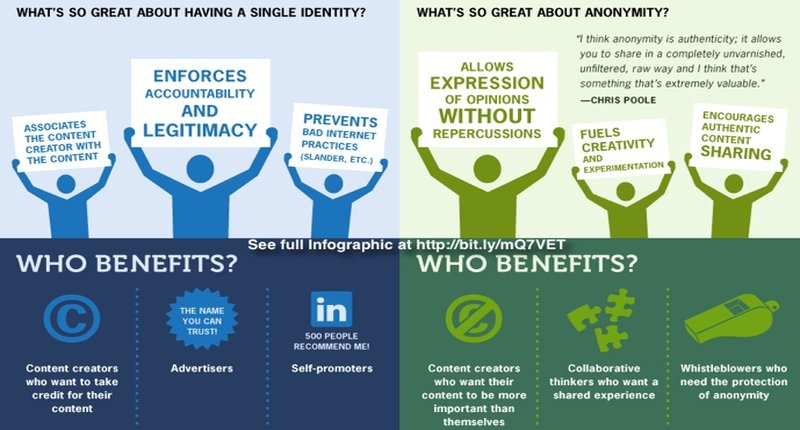
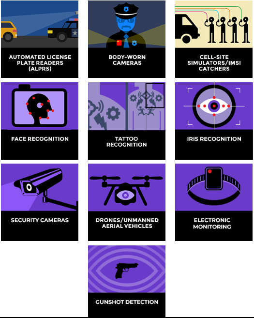
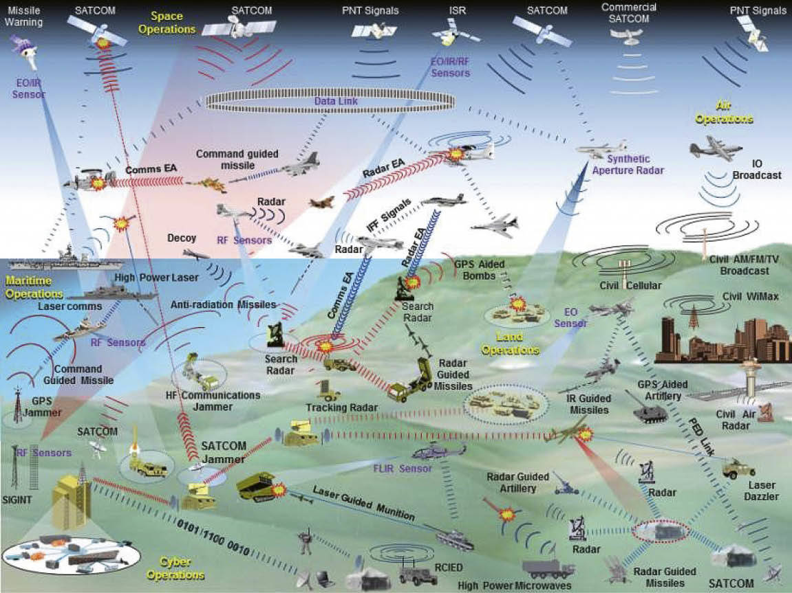
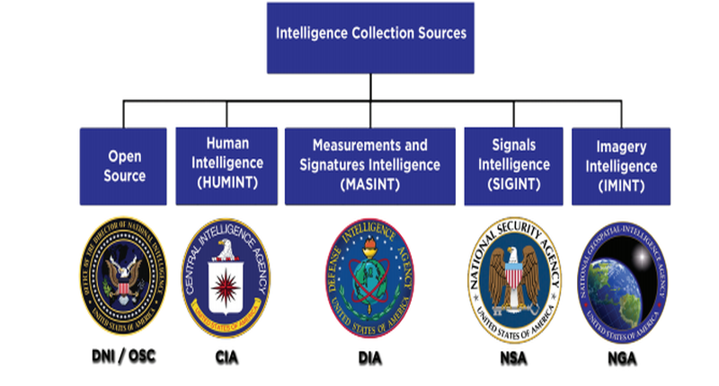

<!DOCTYPE html>
<html lang='en'>

<head>

  <meta charset='UTF-8'>

<body>

<h1>🕵🌐👤🤫 ANONYMITY 🤫👤🌐🕵</h1>

<blockquote><h3>"The primary threat facing someone trying to stay anonymous on the internet today is their own bad opsec, 
and that is precisely the same as it was in 2013. Tails and Tor reduced the number of ways anyone on my 
team could make dangerous mistakes, and so were crucial protections." (Edward Snowden)</h3></blockquote>

<!-- ################################################# -->

  
<h3>BEST REFERENCES</h3>

<table valign="top" style="width:100%; border: none;" cellspacing="0" cellpadding="0">
<thead>
<tr>
<td valign="top" style="height:25%">
<a href="https://www.whonix.org/wiki/Tips_on_Remaining_Anonymous" target="_blank" rel="noopener noreferrer"><b>Whonix</b> - Tips on Remaining Anonymous</a> 
<a href="https://www.whonix.org/wiki/Essential_Host_Security" target="_blank"><b>Whonix</b> - Essential Host Security</a> 
<a href="https://www.whonix.org/wiki/System_Hardening_Checklist" target="_blank"><b>Whonix</b> - System Hardening Checklist</a> 
<a href="https://anonymousplanet.org/" target="_blank"><b>Anonymous Planet</b> - The Hitchhiker’s Guide</a>&nbsp;<a href="https://anonymousplanet.org/export/guide.pdf" target="_blank">(PDF)</a> 
<a href="https://hackmd.io/YKjhguQES_KeKYs-v1YC1w?view" target="_blank" rel="noopener noreferrer"><b>HackMD</b> - How to stay anon</a> 
<a href="https://www.eff.org/" target="_blank" rel="noopener noreferrer"><b>EFF Foundation</b></a> 
<a href="https://www.securityeducationcompanion.org/" target="_blank" rel="noopener noreferrer">EFF Security Companion</a> 
<a href="https://www.anarsec.guide" target="_blank" rel="noopener noreferrer">Anarsec</a> 
<a href="https://kycnot.me/" target="_blank" rel="noopener noreferrer">KYC? Not me</a> 
<a href="https://freedom.press/training" target="_blank" rel="noopener noreferrer">Freedom Press</a> 	
<a href="https://www.techsafety.org" target="_blank" rel="noopener noreferrer">Safety Net Project</a> 
<a href="https://nomoregoogle.com/" target="_blank" rel="noopener noreferrer">No More Google</a> 
</td>

<td valign="top" style="height:25%">
<a href="https://github.com/undergroundwires/privacy.sexy" target="_blank" rel="noopener noreferrer">Privacy Sexy</a> 	
<a href="https://github.com/mikeroyal/Open-Source-Security-Guide" target="_blank" rel="noopener noreferrer">Open Source Security Guide</a> 
<a href="https://github.com/ffffffff0x/Digital-Privacy" target="_blank" rel="noopener noreferrer">Digital Privacy</a> 
<a href="https://github.com/BlockchainCommons/Pseudonymity-Guide" target="_blank" rel="noopener noreferrer">Pseudonymity Guide</a> 
<a href="https://github.com/danoctavian/awesome-anti-censorship" target="_blank" rel="noopener noreferrer">Awesome Anti-censorship</a> 
<a href="https://forensics.wiki/anti_forensic_techniques" target="_blank" rel="noopener noreferrer">Anti-forensic Techniques</a> 
<a href="https://github.com/shadawck/awesome-anti-forensic" target="_blank" rel="noopener noreferrer">Awesome Anti-forensic</a> 
<a href="https://github.com/PaulNorman01/Forensia" target="_blank" rel="noopener noreferrer">Forensia</a> 
<a href="https://github.com/CheckPointSW/Evasions" target="_blank" rel="noopener noreferrer">Evasion Techniques</a> 
<a href="https://github.com/KevinColemanInc/awesome-privacy" target="_blank" rel="noopener noreferrer">Awesome Privacy</a> 	
<a href="https://github.com/awesome-selfhosted/awesome-selfhosted" target="_blank" rel="noopener noreferrer">Awesome Self-hosted</a> 	
<a href="https://github.com/awesome-vpn/awesome-vpn" target="_blank" rel="noopener noreferrer">Awesome VPN</a> 	
<a href="https://github.com/Lissy93/personal-security-checklist" target="_blank" rel="noopener noreferrer">Personal Security Checklist</a> 	
<a href="https://github.com/cryptoanarchywiki/cryptoanarchywiki.github.io" target="_blank" rel="noopener noreferrer">Cryptoanarchy Wiki</a> 	
<a href="https://github.com/tombusby/cypherpunk-research" target="_blank" rel="noopener noreferrer">Cypherpunk Research</a> 	
</td>

<td valign="top" style="height:25%">
<a href="https://haveibeenpwned.com" target="_blank" rel="noopener noreferrer">Have I Been Pwned ?</a> 
<a href="https://joindeleteme.com" target="_blank" rel="noopener noreferrer">Join Delete Me</a> 
<a href="https://www.accountkiller.com" target="_blank" rel="noopener noreferrer">Account Killer</a> 
<a href="https://prism-break.org" target="_blank" rel="noopener noreferrer">Prism-Break</a> 
<a href="https://spreadprivacy.com" target="_blank" rel="noopener noreferrer">Spread Privacy</a> 
<a href="https://www.privacyguides.org  " target="_blank" rel="noopener noreferrer">Privacy Guides</a> 
<a href="https://privacytools.io" target="_blank" rel="noopener noreferrer">Privacy Tools</a> 
<a href="https://proprivacy.com" target="_blank" rel="noopener noreferrer">Pro Privacy</a> 
<a href="https://www.whois.com" target="_blank" rel="noopener noreferrer">Whois</a> 
<a href="https://gdpr-info.eu/issues/right-to-be-forgotten" target="_blank" rel="noopener noreferrer">GDPR - Right to be forgotten</a> 
<a href="https://tosdr.org" target="_blank" rel="noopener noreferrer">Terms of Service, Didn't Read</a> 
</td>

<td valign="top" style="height:25%">
<a href="https://www.reddit.com/r/privacy" target="_blank" rel="noopener noreferrer">r/privacy</a> 
<a href="https://www.reddit.com/r/opsec/" target="_blank" rel="noopener noreferrer">r/opsec</a> 
<a href="https://www.reddit.com/r/redteamsec" target="_blank" rel="noopener noreferrer">r/redteamsec</a>  
<a href="https://www.reddit.com/r/netsec" target="_blank" rel="noopener noreferrer">r/netsec</a>  
<a href="https://www.reddit.com/r/onion" target="_blank" rel="noopener noreferrer">r/onion</a> 
<a href="https://www.reddit.com/r/TOR" target="_blank" rel="noopener noreferrer">r/TOR</a>  
<a href="https://www.reddit.com/r/tails" target="_blank" rel="noopener noreferrer">r/tails</a> 
<a href="https://www.reddit.com/r/computerforensics" target="_blank" rel="noopener noreferrer">r/computerforensics</a>  
<a href="https://www.reddit.com/r/Smartphoneforensics" target="_blank" rel="noopener noreferrer">r/Smartphoneforensics</a>  
<a href="https://www.reddit.com/r/antiforensics" target="_blank" rel="noopener noreferrer">r/antiforensics</a>  
<a href="https://www.reddit.com/r/crypto" target="_blank" rel="noopener noreferrer">r/crypto</a>  
<a href="https://www.reddit.com/r/Piracy" target="_blank" rel="noopener noreferrer">r/Piracy</a>  
<a href="https://www.reddit.com/r/Scams" target="_blank" rel="noopener noreferrer">r/Scams</a>  
<a href="https://www.reddit.com/r/oopsec/" target="_blank" rel="noopener noreferrer">r/oopsec</a> 
<a href="https://www.reddit.com/r/privacymemes" target="_blank" rel="noopener noreferrer">r/privacymemes</a> 
<a href="https://www.reddit.com/r/ghostguns" target="_blank" rel="noopener noreferrer">r/ghostguns</a> 
<a href="https://www.reddit.com/r/drones" target="_blank" rel="noopener noreferrer">r/drones</a> 
<a href="https://old.reddit.com/r/Save3rdPartyApps/comments/148m42t/the_fight_continues" target="_blank" rel="noopener noreferrer">r/Save3rdPartyApps</a> 
</td>
</tr>
</thead>
</table>

 

<!-- ################################################# -->

<h3>Privacy vs. Anonymity</h3>

• Identity: the unique set of characteristics that can be used to identify a person and their unique physical body as themself and no one else.

• Pseudonymity: the near-anonymous state in which a person has a consistent identifier [1] that is not their real name.

• Anonymity: the state of a person's identity being unknown to all other people than themself.

Ref.: https://www.whonix.org/wiki/Tips_on_Remaining_Anonymous

<table>
<thead>
  <tr>
    <th colspan="2" rowspan="2">PRIVACY VS. ANONYMITY</th>
    <th colspan="3">PRIVACY</th>
  </tr>
  <tr>
    <th>PUBLIC</th>
    <th>SEMI-PRIVATE</th>
    <th>PRIVATE</th>
  </tr>
</thead>
<tbody>
  <tr>
    <td rowspan="3">ANONYMITY</td>
    <td>TRUE IDENTITY</td>
    <td>Public business deal</td>
    <td>Online credit card transaction</td>
    <td>Cash transaction between friends</td>
  </tr>
  <tr>
    <td>PSEUDO-ANONYMOUS</td>
    <td>Public auction with unnamed buyer</td>
    <td>Centralized marketplace sale with Bitcoin</td>
    <td>Descentralized marketplace sale with Bitcoin</td>
  </tr>
  <tr>
    <td>ANONYMOUS</td>
    <td>Wikileaks annouces anonymous cryptocyrrency donation</td>
    <td>Centralized marlketplace sale with annonymous  cryptocurrency (Monero)</td>
    <td>Descentralized marketplace sale with anonnymous cryptocurrency (Monero)</td>
  </tr>
</tbody>
</table>

<!-- ################################################# -->
<h3>Privacy-Anonymity Spectrum</h3>

<!-- ################################################# -->
<h3>Privacy Benefits</h3>

<!-- ################################################# -->
<h3>Flag Theory - <a href="https://flagtheory.com">https://flagtheory.com</a></h3>

<!-- ################################################# -->
<h3>EFF’s “Street-Level Surveillance” - <a href="https://www.eff.org/sls">https://www.eff.org/sls</a></h3>

<!-- ################################################# -->
<h3>Electronic Warfare</h3>

<!-- ################################################# -->

<h3>INTELLIGENCE STRATEGY</h3>

https://www.dni.gov/index.php/what-we-do/what-is-intelligence 

<h4>Types of Intelligence</h4>

"The intelligence cycle is a process of collecting information and developing it into intelligence for use by IC customers. The steps in the process are direction, collection, processing, exploitation, and dissemination. IC products can either be based on a single type of collection or “all-source,” that is, based upon all available types of collection. IC products also can be produced by one IC element or coordinated with other IC elements, and delivered to IC customers in various formats, including papers, digital media, briefings, maps, graphics, videos, and other distribution methods."

<h4>Six basic intelligence sources, or collection disciplines</h4>

SIGINT — Signals intelligence is derived from signal intercepts comprising -- however transmitted -- either individually or in combination: all communications intelligence (COMINT), electronic intelligence (ELINT) and foreign instrumentation signals intelligence (FISINT). The National Security Agency is responsible for collecting, processing, and reporting SIGINT. The National SIGINT Committee within NSA advises the Director, NSA, and the DNI on SIGINT policy issues and manages the SIGINT requirements system.

IMINT — Imagery Intelligence includes representations of objects reproduced electronically or by optical means on film, electronic display devices, or other media. Imagery can be derived from visual photography, radar sensors, and electro-optics. NGA is the manager for all imagery intelligence activities, both classified and unclassified, within the government, including requirements, collection, processing, exploitation, dissemination, archiving, and retrieval.

MASINT — Measurement and Signature Intelligence is information produced by quantitative and qualitative analysis of physical attributes of targets and events to characterize, locate, and identify them. MASINT exploits a variety of phenomenologies, from a variety of sensors and platforms, to support signature development and analysis, to perform technical analysis, and to detect, characterize, locate and identify targets and events. MASINT is derived from specialized, technically-derived measurements of physical phenomenon intrinsic to an object or event and it includes the use of quantitative signatures to interpret the data. The Director of DIA is both the “Intelligence Community Functional Manager for MASINT” and the “DOD MASINT Manager.” The National MASINT Office (NMO) manages and executes MASINT services of common concern and related activities for the D/DIA in response to National and Department of Defense requirements. If interested in learning more about MASINT, check out the NMO's primer here.

HUMINT — Human intelligence is derived from human sources. To the public, HUMINT remains synonymous with espionage and clandestine activities; however, most of HUMINT collection is performed by overt collectors such as strategic debriefers and military attaches. It is the oldest method for collecting information, and until the technical revolution of the mid- to late 20th century, it was the primary source of intelligence.

OSINT — Open-Source Intelligence is publicly available information appearing in print or electronic form including radio, television, newspapers, journals, the Internet, commercial databases, and videos, graphics, and drawings. While open-source collection responsibilities are broadly distributed through the IC, the major collectors are the DNI's Open Source Center (OSC) and the National Air and Space Intelligence Center (NASIC).

GEOINT — Geospatial Intelligence is the analysis and visual representation of security related activities on the earth. It is produced through an integration of imagery, imagery intelligence, and geospatial information.

 

<!-- ################################################# -->

👷🛠️UNDER CONSTRUCTION🚧🏗 

<b>Anonymous devloper</b>​​​​​

 

<h3>How to create an anonymous GitHub</h3>

Protonmail - https://protonmailrmez3lotccipshtkleegetolb73fuirgj7r4o4vfu7ozyd.onion 

!Outdated! 

This is a short guide to help you start developing an anonymous developer account. 

<ol>
<li>Create a new browser profile in your browser of choice<ul>
<li>Firefox and derivatives: <a href="https://support.mozilla.org/en-US/kb/profile-manager-create-remove-switch-firefox-profiles">https://support.mozilla.org/en-US/kb/profile-manager-create-remove-switch-firefox-profiles</a></li>
<li>Chrome and derivaties: <a href="https://support.google.com/chrome/answer/2364824?hl=en&amp;co=GENIE.Platform%3DDesktop">https://support.google.com/chrome/answer/2364824?hl=en&amp;co=GENIE.Platform%3DDesktop</a></li>
</ul>
</li>

<li>Create a new <a href="https://protonmail.com/">Protonmail</a> account. <ul>
<li>Protonmail doesn&#39;t ask for any personally identifiable information when setting up a new account</li>
<li>For recovery options, ensure that you don&#39;t use an email that can dox or your phone number</li>
</ul>
</li>
<li>Create a corresponding <a href="https://protonvpn.com">ProtonVPN</a> account<ul>
<li>Use this VPN whenever you are in <em>anon</em> mode</li>
</ul>
</li>
<li>Create a <a href="https://github.com/">GitHub</a> account with your new email<ul>
<li>Generate new SSH keys and add them to this GitHub account</li>
</ul>
</li>
<li>Create a new <a href="https://twitter.com">Twitter</a> account with your new identity</li>
<li>Create a new <a href="https://www.reddit.com/">Reddit</a> account with your new identity<ul>
<li>Use a request subreddit of your choice to get a new unique pfp for your new anon account</li>
</ul>
</li>
<li>Create a <a href="https://cryptpad.fr/">cryptpad.fr</a> and a hackmd account for all your note taking, and encrypted storage needs</li>
<li>Go on <a href="https://www.privacytools.io/">privacytools.io</a> for other tools that you can use to keep yourself private</li>
<li>(Optional) Install ublock origin, privacy badger and https everywhere in your new browser profile</li>
<li>Extra reading and considerations: <a href="https://hackmd.io/YKjhguQES_KeKYs-v1YC1w?view">0xngmi&#39;s guide for staying anon</a></li>
</ol>

Credits: https://github.com/Mikerah/anon-guide 

 

<!-- ###################### -->

<b>How to erase GitHub history</b>

 

Credits: https://github.com/fedebotu/clone-anonymous-github 

 

<!-- ###################### -->

<b>Contribute code anonymously</b>

 

Credits: https://github.com/AnalogJ/gitmask 

 

<!-- ###################### -->

<b>Proxy server to support anonymous browsing</b>

 

Credits: https://durieux.me/projects/anonymous-github.html 
Credits: https://github.com/tdurieux/anonymous_github 

 

<!-- ###################### -->

<b>Secure operating systems</b>

 

<h4>Secure Operating Systems</h4>

<h4>Tails</h4>

 
<a href="https://www.youtube.com/watch?v=01oeaBb85Xc">

 

Tor Wiki - https://gitlab.torproject.org/legacy/trac/-/wikis/doc/OperationalSecurity

<h4>Protocol Leak and Fingerprinting Protection</h4>  
https://www.whonix.org/wiki/Protocol-Leak-Protection_and_Fingerprinting-Protection#Less_important_identifiers 

<h4>Attacks on Tor</h4>  
https://github.com/Attacks-on-Tor/Attacks-on-Tor 

<h4>Whonix</h4>
https://www.whonix.org 

<h4>Tails Vs. Whonix</h4>
https://www.whonix.org/wiki/Comparison_with_Others 

<h4>QubesOS</h4>
https://www.qubes-os.org 
https://osresearch.net/InstallingOS 

 

<b>Secure communications</b>

 

<h4>Anon Internet</h4>
• Tor - https://www.torproject.org - Tor is free software and an open network that helps you defend against traffic analysis. 
• I2P - https://geti2p.net/en/ - I2P is an anonymous overlay network - a network within a network. It is intended to protect communication from dragnet surveillance and monitoring by third parties such as ISPs. 
• Freenet - https://freenetproject.org - Freenet is free software which lets you anonymously share files, browse and publish "freesites" (web sites accessible only through Freenet) and chat on forums, without fear of censorship. 
• Zeronet - https://zeronet.io - Open, free and uncensorable websites, using Bitcoin cryptography and BitTorrent network 
• Loki - https://github.com/loki-project/loki-network - Lokinet is an anonymous, decentralized and IP based overlay network for the internet. 
• IPFS - https://ipfs.io - A peer-to-peer hypermedia protocol designed to make the web faster, safer, and more open. 
• Yggdrasil - https://yggdrasil-network.github.io/about.html - Makes use of a global spanning tree to form a scalable IPv6 encrypted mesh network. 
• Nym - https://github.com/nymtech/nym - Nym provides strong network-level privacy against sophisticated end-to-end attackers, and anonymous transactions using blinded, re-randomizable, decentralized credentials. 

<h4>VPN Guides and Tutorials</h4>
• r/vpnrecommendations - https://www.reddit.com/r/vpnrecommendations 
• r/VPN - https://www.reddit.com/r/VPN/wiki/index 
• r/VPNTorrents - https://www.reddit.com/r/VPNTorrents 
• Choosing the best VPN (for you) - https://www.reddit.com/r/VPN/comments/4iho8e/that_one_privacy_guys_guide_to_choosing_the_best/?st=iu9u47u7&sh=459a76f2 
• Choosing the VPN that's right for you - https://ssd.eff.org/en/module/choosing-vpn-thats-right-you 
• VPN Alert - https://vpnalert.com 
https://github.com/alancnet/torrent-vpn  
• That One Privacy Site - https://thatoneprivacysite.net/vpn-section 
• privacytools.io - https://www.privacytools.io 
• VPN over SSH - https://wiki.archlinux.org/index.php/VPN_over_SSH 

<h4>Anonymous VPN</h4>
• Mullvad - https://mullvad.net 
• Mullvad - http://o54hon2e2vj6c7m3aqqu6uyece65by3vgoxxhlqlsvkmacw6a7m7kiad.onion 
• ProtonVPN - https://protonvpn.com 
• AirVPN - https://airvpn.org 
• IVPN - https://www.ivpn.net  
• VPN.XXX - https://www.vpn.xxx 
• Windscribe - https://windscribe.com 
• ExpressVPN - https://www.expressvpn.com/vpnmentor1 
• Private Internet Access - https://www.privateinternetaccess.com 
• NordVPN - https://nordvpn.com 
 
<h4>Others</h4>
• TorPlusVPN - https://gitlab.torproject.org/legacy/trac/-/wikis/doc/TorPlusVPN
• Proxy - https://www.rapidseedbox.com/blog/vpn-vs-proxy 

<h4>Anonymous Communication</h4>

👷🛠️UNDER CONSTRUCTION🚧🏗 

• Matrix Protocol - https://matrix.org 

• Signal - https://community.signalusers.org/t/overview-of-third-party-security-audits/13243 

• Discord Bot 

<h4>Anonymous File Transfer</h4>
• Onion Share - https://github.com/onionshare/onionshare 

<h4>Email</h4>

<b>Privacy</b> 
• Protonmail -  
• Protonmail - https://protonmailrmez3lotccipshtkleegetolb73fuirgj7r4o4vfu7ozyd.onion 
• Burner Email - https://github.com/wesbos/burner-email-providers 

<b>Self-hosted Email</b> 
• Burnermail.io - https://burnermail.io/ 
• Anonaddy.com - https://anonaddy.com/#pricing 
• Simplelogin.io - https://simplelogin.io/ 
• Simplelogin.io GitHub - https://github.com/simple-login/app 
• Forward Email - https://forwardemail.net/en 
• Thread r/selfhosted - https://www.reddit.com/r/selfhosted/comments/isu8mw/selfhosted_throw_away_email_addresses_that_allow/ 

<b>Temp Email</b> 
• Guerrilla Mail - https://www.guerrillamail.com</a> 
• 10MinuteMail - https://10minutemail.com 
• http://www.yopmail.com/zh 
• http://www.fakemailgenerator.com 
• https://temp-mail.org/en 
• https://www.guerrillamail.com 
• http://tool.chacuo.net/mailsend 
• https://maildrop.cc 
• http://tool.chacuo.net/mailanonymous 
• https://tempmail.altmails.com 
• https://www.snapmail.cc 
• https://www.linshi-email.com 

<h4>Utilities and Spoof</h4>
• Text Fixer - https://www.textfixer.com 
• SS64 Syntax Utils - https://ss64.com  
• Tools4noobs - https://www.tools4noobs.com 
• Text to ASCII Art Generator - https://patorjk.com/software/taag 
• Commonly Used Software Development Tools - https://ctool.dev

<h4>Generators</h4>

<h5>Image Generation</h5>
• This Person Does Not Exist - https://thispersondoesnotexist.com 
• This Waifu Does Not Exist - https://www.thiswaifudoesnotexist.net/?ref=appinn 
• These Cats Do Not Exist - http://thesecatsdonotexist.com/ 
• Gallery of AI Generated Faces | Generated.photos - https://generated.photos/faces 
• Pixel-me - https://pixel-me.tokyo/en 
• Artbreeder - https://artbreeder.com/browse 
• Comixify - https://comixify.ii.pw.edu.pl 
• Which Face is Real? - http://www.whichfaceisreal.com 
• SPADE Project Page - https://nvlabs.github.io/SPADE 
• Selfie2Anime - https://selfie2anime.com 
• Reflect.tech - https://reflect.tech/faceswap/hot 
• PaddleGAN - https://github.com/PaddlePaddle/PaddleGAN 
• Random Pic - https://picsum.photos 

<h5>Name, Address, IDs Generators</h5>
• Fake Name Generator - https://www.fakenamegenerator.com 
• Fake Address, Random Address Generator - https://www.fakeaddressgenerator.com/Index/index 
• Behind the Name - https://www.behindthename.com/random 
• Easy Random Name Picker - https://randomwordgenerator.com/name.php  
• Random User Generator - https://randomuser.me  
• ID Free Site - https://id.ifreesite.com  
• Fake ID - https://www.elfqrin.com/fakeid.php 
• Credit Card Generator - https://www.elfqrin.com/discard_credit_card_generator.php  
• Credit Card BINs generator and validator - https://www.elfqrin.com/credit_card_bin_generator.php  
• US SSN / Driver License (DL) / State ID / Passport / Tax ID Generator - https://www.elfqrin.com/usssndriverlicenseidgen.php  
• US Car License Plates Registration Tags Generator - https://www.elfqrin.com/uscarlicenseplates.php 
• airob0t/idcardgenerator - https://github.com/airob0t/idcardgenerator 
• gh0stkey/RGPerson - https://github.com/gh0stkey/RGPerson 
• naozibuhao/idcard - https://github.com/naozibuhao/idcard 
• Just Delete Me - https://backgroundchecks.org/justdeleteme/fake-identity-generator 
• Fake Person/Name Generator | User Identity, Account and Profile Generator - https://fakepersongenerator.com 
• faker.js - https://cdn.rawgit.com/Marak/faker.js/master/examples/browser/index.html 
• Fake Person/Name Generator - https://www.fakepersongenerator.com/Index/generate 
• Full Contact Information Generator - https://names.igopaygo.com/people/full-contact 
• My Fake Information Generator and Validator - http://www.myfakeinfo.com/index.php 
• User Information Generator Articles - https://names.igopaygo.com 

 

<!-- ################################################# -->

<b>Others</b>

 

<h3>Others</h3>

<h4>Piracy</h4>
https://github.com/Igglybuff/awesome-piracy 
https://github.com/lkrjangid1/Awesome-Warez 
https://github.com/Illegal-Services/Illegal_Services 
https://github.com/Lucetia/piracy 
https://github.com/the-rarbg/yaps 
https://torrentfreak.com 
https://lemmy.dbzer0.com/c/piracy 
https://rentry.co/megathread 
https://1337x.to 
https://fitgirl-repacks.site 

<h4>Self-hosting</h4>
https://www.reddit.com/r/selfhosted 
https://github.com/awesome-selfhosted/awesome-selfhosted  
https://github.com/syncthing/syncthing 
https://github.com/anonaddy/anonaddy 

<h4>EXIF Tools</h4>
• exifcleaner (GUI)- https://github.com/szTheory/exifcleaner/releases/latest 
• exiftool (CLI)- https://exiftool.org 
• Exif Pilot - https://www.colorpilot.com/exif.html 
• Vereexif - https://www.verexif.com/en/ 

• Deceptive Patterns  
https://www.deceptive.design  

<h4>• Random MAC Address</h4>

<pre>
&nbsp; 
&nbsp; &nbsp; $ ip link
&nbsp; &nbsp; $ sudo ifconfig wlan0 down
&nbsp; &nbsp; $ sudo macchanger -r wlan0
&nbsp; &nbsp; • Shows specified MAC Address of NIC
&nbsp; &nbsp; $ sudo macchanger -s wlan0
&nbsp; &nbsp; $ sudo ifconfig wlan0 up
</pre>

<h4>• Opt-Out WLAN-SSID</h4>

To opt-out of <b>global maps</b> (https://wigle.net), rename your network WiFi SSID to
<pre> &lt;SSID&gt;_optout_nomap </pre>

<h3>• To opt-out of Mozilla Location Services</h3>

Go to https://location.services.mozilla.com/optout 

 

 

<!-- ################################################# -->

👷🛠️UNDER CONSTRUCTION🚧🏗 

Biometrics Anti-surveillance​

 

<h4>Facial Recognition</h4>

• Fawkes: Protecting Privacy against Unauthorized Deep Learning Models 
https://www.usenix.org/conference/usenixsecurity20/presentation/shan 
https://github.com/Shawn-Shan/fawkes 

• Invisible Mask: Practical Attacks on Face Recognition with Infrared  
https://arxiv.org/pdf/1803.04683.pdf  
https://www.digitaltrends.com/cool-tech/facial-recognition-hat-infrared  

• Adversarial Mask - Real-World Universal Adversarial Attack on Face Recognition Models  
https://arxiv.org/abs/2111.10759  
https://www.youtube.com/watch?v=_TXkDO5z11w 

• A Poisoning Attack Against Unsupervised Template Updating" 
https://github.com/ssloxford/biometric-backdoors 

<h4>ADVERSARIAL MACHINE LEARNING</h4>
https://github.com/yenchenlin/awesome-adversarial-machine-learning 

<h4>FINGERPRINT RECOGNITION</h4>
• DEF CON Safe Mode - Yamila Levalle - Bypassing Biometric Systems with 3D Printing  
https://www.youtube.com/watch?v=hJ35ApLKpN4 

 

<!-- ######################### -->

Physical Anti-surveillance

 

<h4>Physical Anti-surveillance</h4>

https://paladinpressbooks.com  
https://us.artechhouse.com/storehome.aspx  

<h4>Hidden Objects</h4>

• Hire an object storage service anonymously ("box self storage") 
• How to Hide Things in Public Places - Dennis Fiery 
• DIY Secret Hiding Places: 90 Places To Hide What You Don't Want Found! - Steve Plant 
• The Big Book of Secret Hiding Places - Jack Luger 
• https://www.boredpanda.com/how-to-hide-things-secret-hiding-places 

 

<!-- ######################### -->

Little Tricks​

 

Illegaly left you alone with a secret recording device. 
Illegaly put GPS in your vehicle (GSM Chip). 
Illegaly use traker programms (e. g. FirsMile) in your devices. 
Illegaly use facial regonition cammeras spread in the city or in public transport. 
Illegaly use state database or state informants. 

 

<!-- ######################### -->

Documents

 

<h4>Registre Exp</h4>
• With less utility, you can easily use RegExp patterns. 

<h4>Fake IDs</h4>
• At onion hidden services (this is probably scam, check the seller's reputation). 
• Consult your friends, criminal lawyers probably know where to find things. 
• Depending on the country or state of the federation you are in, there are documents that are easier to find. 

 

<!-- ######################### -->

Business Intelligence

 

<h4>Financial Intelligence</h4>

• Financial Intelligence Units (FIUs) 
Automated triage of financial intelligence reports - Algorithms 

• Artificial Intelligence, Machine Learning and Big Data in Finance 

https://www.oecd.org/finance/financial-markets/Artificial-intelligence-machine-learning-big-data-in-finance.pdf 

<h4>Cryptocurrency</h4>

•  

 

<!-- ######################### -->

Criminal Investigation

 

<h4>Criminal Investigation</h4>

<h5>Investigation by Law Enforcement Agencies (LEA)</h5>

Ways law enforcement investigate

• Trash Pull 
• Malwares 
• Search Warrant 
• Photographs enhancement techniques 
• Video enhancement techniques 
• Audio enhancement techniques 
• Fingerprints 
• DNA testing 
• Blood tests 
• Ballistics 

<h5>Undercover Agents</h5>
• Covert Agent - https://www.rbth.com/history/335021-kgb-guide-how-detect-foreign-spy 
• Undercover Employees, Informants, and Cooperating Witnesses 

<h5>Interrogations and torture</h5>
• Interrogation techniques 
• US Guantanamo 
• SS Nazi Training 

 

<!-- ######################### -->

Others

 

<h4>Others</h4>

• Surveillance Report 
https://surveillancereport.tech 

• IntelTechniques 
https://inteltechniques.com/links.html 

 

 

<!-- ################################################# -->

<h1>REFLECTIONS ON RESISTANCE</h1>

👷🛠️UNDER CONSTRUCTION🚧🏗 

Considerations

 

<h4>Considerations - Notebooks</h4>

• Conflicts with definable objective. 
• Conflicts with definable political objective (guerillas ?). 
• Conflicts with no definable objective (anarchists ?). 
• Resistance by dominated groups. 
• Resistance by dominated groups using means that do not disturb their internal unity. 
• Disruptive actions by individuals. Resistance by dominated individuals. 
• Disruptive political actions by individuals. 
• As a rule, groups are stronger than individuals. However, there are dissidents in high positions. 
• Analysis of fallacious speeches or actions justified on the basis of high moral values or "true crimes". 
• Analysis of fallacious speeches or actions justified on the basis of insurmountable civilizational limits. 
• Analysis of fallacious speeches or actions justified on the basis of fear, risk or exceptional cases. 
• To be one step ahead, only with a lot of money from the state. Resistance will always be asymmetric. 
• Why are you going to prison if you don't want to do military service? 
• Organic intellectuality, institutions, economic groups and religiuous groups. 
• Criminology concepts, policy of "zero tolerance", "war on drugs/terrorism", "enemy". 
• UNO doesn't work as well as the Supreme Court. 

 

<!-- ######################### -->

Interesting News

 

<h4>https://theintercept.com</h4>

• CATFISHED BY COPS - The Hamas Terrorist Who Wasn’t - The Intecept 
https://theintercept.com/2023/12/18/fbi-nypd-catfishing-terrorism-sting-hamas 
• THE SNITCH IN THE SILVER HEARSE - The FBI Paid a Violent Felon to Infiltrate Denver’s Racial Justice Movement - The Intecept 
https://theintercept.com/2023/02/07/fbi-denver-racial-justice-protests-informant/ 
“They Believed Anything but the Truth” — 14 Years in Guantánamo 
https://theintercept.com/2021/08/17/guantanamo-memoir-mansoor-adayfi/ 

etc, etc, etc... 

<h4>https://truthout.org</h4>

• Police Tech Isn’t Designed to Be Accurate — It’s Made to Exert Social Control 
https://truthout.org/articles/police-tech-isnt-designed-to-be-accurate-its-made-to-exert-social-control 
• NYPD Has Used Drones to Monitor Pro-Palestine Protests, Make 239 Arrests 
https://truthout.org/articles/nypd-has-used-drones-to-monitor-pro-palestine-protests-make-239-arrests/ 
• In New York, Inadequate Treatment Is Turning Drug Arrests Into Death Sentences 
https://truthout.org/articles/in-new-york-inadequate-treatment-is-turning-drug-arrests-into-death-sentences/ 
• I Faced Death by Incarceration. The UN Heard My Plea to Abolish Life Sentences. 
https://truthout.org/articles/i-faced-death-by-incarceration-the-un-heard-my-plea-to-abolish-life-sentences/ 

etc, etc, etc... 

<h4>https://thehackernews.com</h4>

•  
https://thehackernews.com/2023/12/british-lapsus-teen-members-sentenced.html 
•  
https://thehackernews.com/2015/08/lizard-squad-hackers-arrested.html 

etc, etc, etc... 

 

<!-- ######################### -->

General Anti-surveillance

 

<h4>Brainstorm: strategy, techniques and skills</h4>

<h5>Strategy</h5>
• Analysis of forms of resistance by dominated groups using means that do not disturb their internal unity. 
• Analysis of fallacious speeches justified on the basis of high moral values. 

<h5>Governments & Politicians</h5>
- Fear to manipulate public opinion 
- Moral scandals and accusations 
- Negotiation and association 
- Tenders with the companies themselves 
- Enticement of the media and state agents 
- Using the system for your own benefit 
- Offering positions and promotions 
- Tailor-made laws 

<h6>Journalism</h5>
- Whistleblowers 
- International Journalism Festival - https://www.youtube.com/@journalismfest 

<h6>Mass Media</h5>
- Hollywood Propaganda (films, docs etc) 
- Steve Bannon - Cambridge Analytica 

<h5>Spies</h5>
- Books about american, british and russian spies 
- Dead drop technique 
- Books, books, books... 
 
<h5>Anarchists</h5>
- Books, books, books... 
- https://github.com/cryptoanarchywiki/cryptoanarchywiki.github.io 

<h5>Jews</h5>
- Books, books, books... 

<h5>Slaves</h5>
- Books, books, books... 

<h5>Aboriginal Groups</h5>
- Books, books, books... 

<h5>Resistance Groups</h5>
- Guerrila warfare 
- Books, books, books... 

<h5>Mobsters & Droug Traffikers</h5>
- Unmasking the informant inside the cartel | Four Corners - https://www.youtube.com/watch?v=Kse32_VpTOE 
- Al Capone

<h5>Counter-culture movement</h5>
- Books, books, books... 

<h3>Other Considerations</h3>

<h5>Hybrid Warfare</h5>
•  

<h5>Information Warfare</h5>
• Fake news 
• New rhetoric 

<h5>Law Warfare</h5>
•  

<h5>Chilling Effect</h5>
•  

<h5>Subversion, mimicry and criminality</h5>

 

<!-- ######################### -->

Academic Considerations

 

<h4>Academic Considerations</h4>

<h5>Organic and inorganic intellectuals?</h5>

<h5>Where is the truth? Is this all power, strength, rethoric?</h5>

• Sun Tzu (544 - 496 BC) 
• Niccolò Machiavelli (1469 - 1527) 
• Antonio Gramsci (1891 - 1937) 

• Gaston Bachelard (1884 - 1962) 
• Karl Popper (1902 - 1994) 
• Nicos Poulantzas (1936 - 1979) 
• Louis Althusser (1918 - 1990) 

• Hannah Arendt (1906–1975) 

• Friedrich Nietzsche (1844 - 1900) 
• Michel Foucault (1926 - 1984) 
• Noam Chomsky (1928) 
• Slavoj Žižek (1949) 
• Giorgio Agamben (1942) 

 

<!-- ######################### -->

Libraries

 

<DT><H3>Libraries</H3>
     <DT><A HREF="https://go-to-zlibrary.se/#desktop_app_tab"> Z-Library  <PRE> https://go-to-zlibrary.se/#desktop_app_tab</PRE></A>
     <DT><A HREF="http://zlibrary24tuxziyiyfr7zd46ytefdqbqd2axkmxm4o5374ptpc52fad.onion"><DEL> Z-Library   http://zlibrary24tuxziyiyfr7zd46ytefdqbqd2axkmxm4o5374ptpc52fad.onion</DEL></A>
     <DT><A HREF="http://kx5thpx2olielkihfyo4jgjqfb7zx7wxr3sd4xzt26ochei4m6f7tayd.onion">Imperial Library  <PRE> http://kx5thpx2olielkihfyo4jgjqfb7zx7wxr3sd4xzt26ochei4m6f7tayd.onion</PRE></A>
     <DT><A HREF="http://libraryfyuybp7oyidyya3ah5xvwgyx6weauoini7zyz555litmmumad.onion">Just Another Library  <PRE> http://libraryfyuybp7oyidyya3ah5xvwgyx6weauoini7zyz555litmmumad.onion</PRE></A>
     <DT><A HREF="http://libraryqxxiqakubqv3dc2bend2koqsndbwox2johfywcatxie26bsad.onion">The Anarchist Library  <PRE> http://libraryqxxiqakubqv3dc2bend2koqsndbwox2johfywcatxie26bsad.onion</PRE></A>
     <DT><A HREF="http://w27irt6ldaydjoacyovepuzlethuoypazhhbot6tljuywy52emetn7qd.onion">InfoCon  <PRE> http://w27irt6ldaydjoacyovepuzlethuoypazhhbot6tljuywy52emetn7qd.onion</PRE></A>
     <DT><A HREF="https://libgen.is/">GenoType.INC  <PRE>https://libgen.is/</PRE></A>
     <DT><A HREF="http://libgen.li">GenoType.INC  <PRE>http://libgen.li</PRE></A>
     <DT><A HREF="http://libgenfrialc7tguyjywa36vtrdcplwpxaw43h6o63dmmwhvavo5rqqd.onion">GenoType.INC  <PRE> http://libgenfrialc7tguyjywa36vtrdcplwpxaw43h6o63dmmwhvavo5rqqd.onion</PRE></A>

 

 

<!-- ################################################# -->

👷🛠️UNDER CONSTRUCTION🚧🏗 

Privacy​​​ Software​ Alternatives​

 

<ul>

<li>General 
<a href="https://github.com/zedeus/nitter/wiki/Instances">Nitter instances</a> 
<a href="https://docs.invidious.io/Invidious-Instances.md">Invidious instances</a> 
<a href="https://git.sr.ht/~cadence/bibliogram-docs/tree/master/docs/Instances.md">Bibliogram instances</a> 
<a href="https://git.sr.ht/~metalune/simplytranslate_web#list-of-instances">SimplyTranslate instances</a> 
<a href="https://wiki.openstreetmap.org/wiki/Tile_servers">OpenStreetMap tile servers</a> </li>

<li>Reddit alternatives: 
<a href="https://github.com/spikecodes/libreddit#instances">Libreddit</a> 
<a href="https://codeberg.org/teddit/teddit#instances">Teddit</a> 
<a href="https://github.com/snew/snew">Snew</a> 
<a href="https://old.reddit.com">Old Reddit</a> &amp; <a href="https://i.reddit.com">Mobile Reddit</a>, purported to be more privacy respecting than the new UI. </li>

<li>Google Search alternatives: 
<a href="https://duckduckgo.com">DuckDuckGo</a> 
<a href="https://searx.github.io/searx/">SearX</a> 
<a href="https://startpage.com">Startpage</a> 
<a href="https://www.ecosia.org">Ecosia</a> 
<a href="https://www.qwant.com">Qwant</a> 
<a href="https://www.mojeek.com">Mojeek</a> 
<a href="https://www.presearch.org">Presearch</a> 
<a href="https://benbusby.com/projects/whoogle-search/">Whoogle</a> </li>
</ul>

 

<!-- ######################### -->

 

<!-- ################################################# -->

Others​

 

<h4>Others</h4>

UNO IGF - https://www.intgovforum.org

USENIX Conferences - https://www.usenix.org/conferences

Citizenlab - https://citizenlab.ca

Telegram’s blogging platform - https://telegra.ph

Internet Archive - https://archive.org

Archive web content - https://archive.ph

<h4>YouTube - Privacy</h4>

Mental Outlaw - https://www.youtube.com/c/MentalOutlaw

Surveillance Report - https://www.youtube.com/c/SurveillanceReport

Hack In The Box Security Conference - https://www.youtube.com/@hitbsecconf

May Contain Hackers - https://www.youtube.com/@MCh3022NL

European Digital Rights - https://www.youtube.com/@EuropeanDigitalRights

Techlore - https://www.youtube.com/c/Techlore

David Bombal - https://www.youtube.com/c/DavidBombal

Hak5 - https://www.youtube.com/c/hak5

John Hammond - https://www.youtube.com/c/JohnHammond010

Linus Tech Tips - https://www.youtube.com/c/LinusTechTips

Naomi Brockwell: NBTV - https://www.youtube.com/@NaomiBrockwellTV

SecurityFWD - https://www.youtube.com/c/SecurityFWD

Seytonic - https://www.youtube.com/c/Seytonic

Sir Sudo - https://www.youtube.com/c/SirSudo

SomeOrdinaryGamers - https://www.youtube.com/c/SomeOrdinaryGamers

spacehuhn - https://www.youtube.com/c/spacehuhn

ThioJoe - https://www.youtube.com/c/ThioJoe

Luke Smith - https://www.youtube.com/c/LukeSmithxyz

Rob Braxman Tech - https://www.youtube.com/c/BraxMe

The Hated One - https://www.youtube.com/c/TheHatedOne

 

<a href="https://github.com/RENANZG/My-Anonymity#-anonymity-">
Back to Top ⬆
</a>

<!-- ################################################# -->

 
 
 

</body>
</html>
